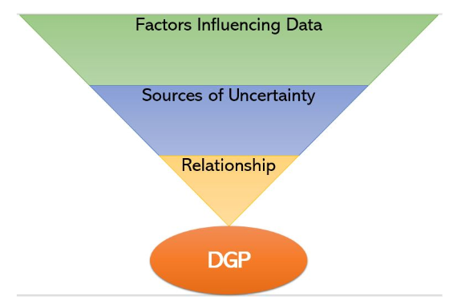

# Statistical Simulation with Python

## 1- Description

Simulations are a class of computational algorithms that use the relatively simple idea of random sampling to solve increasingly complex problems. Although they have been around for ages, they have gained in popularity recently due to the rise in computational power and have seen applications in multiple domains including Artificial Intelligence, Physics, Computational Biology and Finance just to name a few.

Notebooks provided in this repo will guide you through generating and analyzing data over different probability distributions, mostly using NumPy.

## 2- Content

### 2.a- Basics of Randomness & Simulation

An introduction of the tools required to run a simulation.

### 2.b- Probability & Data Generation Process

Provides an introduction to probability concepts and a hands-on understanding of the data generating process.

### 2.c- Resampling Methods

Introduces resampling methods such as Bootstrapping, Jackknife; and Permutation testing.

### 2.d- Applications of Simulation

Some applications of simulation to solve real-world problems. We will work through
- Business planning,
- Monte Carlo integration,
- Power Analysis with simulation,
- a financial portfolio simulation.

## 3- Usage

### 3.a- Notebook Order

It is recommended to go through notebooks in following order:

1. Basics of randomness and Simulation
2. Probability Basics
3. Resampling methods
4. Permutation testing
5. Simulation for business planning
6. Monte Carlo integration
7. Simulation for Power Analysis
8. Portfolio Simulation

### 3.b- Getting the Repository

To download or clone the repository:
- You can either use `git CLI` and type `git clone https://github.com/sukruc/statistical-simulation.git` or,
- Click on the green `Download` button to the upper right corner of the page and download ZIP file.

## 4- Notes

Bonus notebook, Gambler's Ruin, a slight detour from the course, is also included as a sneak peek of upcoming new repository: *Customer Analytics & A/B Testing with Python*

Notebooks have been adapted from Tushar Shanker's course on DataCamp: *Statisctical Simulation in Python*, and revised to deliver the best learning experience.
